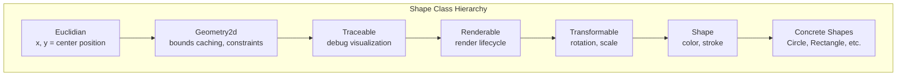
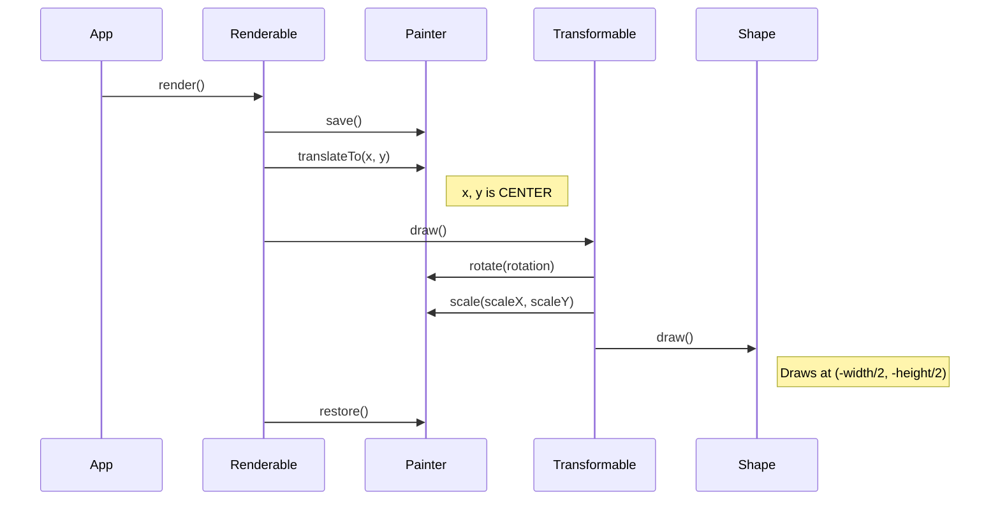
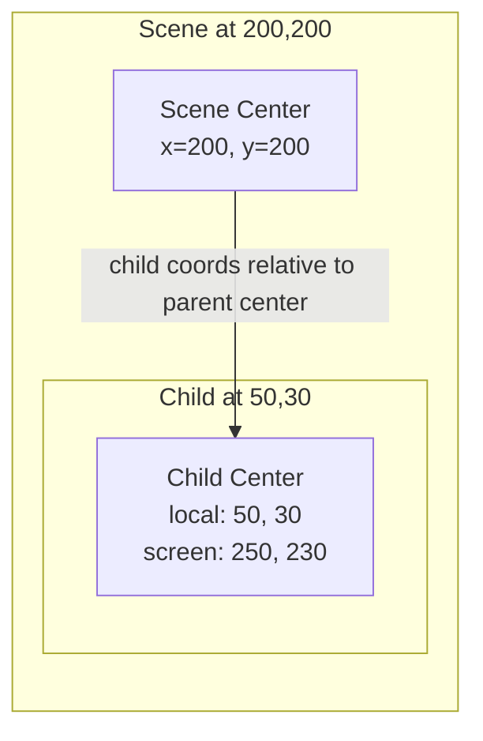

# Coordinate System Refactor RFC

> **Status**: Ready for Implementation  
> **Author**: GCanvas Team  
> **Target Version**: 2.0.0  
> **Decisions Finalized**: Yes (see Section 7)

## Table of Contents

1. [Problem Statement](#1-problem-statement)
2. [Current Behavior](#2-current-behavior)
3. [Proposed Behavior: Flash-Style Registration Point](#3-proposed-behavior-flash-style-registration-point)
4. [Affected Modules](#4-affected-modules)
5. [Migration Strategy](#5-migration-strategy)
6. [Risk Analysis](#6-risk-analysis)
7. [Decisions](#7-decisions)

---

## 1. Problem Statement

### The Core Issue

GCanvas currently uses a **center-based coordinate system** where `x` and `y` properties refer to the center of an object, not its top-left corner. While this was designed to simplify rotation and scaling, it creates significant cognitive overhead and inconsistency with the broader canvas ecosystem.

### Why This Matters

**1. Mental Model Mismatch**

Developers familiar with canvas, CSS, DOM, or most game engines expect top-left positioning:

```javascript
// What developers expect (standard canvas behavior)
ctx.fillRect(100, 100, 50, 30);  // Rectangle starts at (100, 100)

// What GCanvas does
const rect = new Rectangle({ x: 100, y: 100, width: 50, height: 30 });
// Rectangle is CENTERED at (100, 100), so top-left is actually (75, 85)
```

**2. Inconsistent APIs Within GCanvas**

| Context | What `(x, y)` Means |
|---------|---------------------|
| Shape `x`, `y` | Center of shape |
| `Painter.shapes.rect(x, y, ...)` | Top-left corner |
| Canvas API | Top-left corner |
| `getLocalPosition()` | Returns top-left |
| Collision detection | Expects top-left bounds |
| Layout utilities | Returns center positions |

**3. Conversion Overhead**

Users constantly need to convert between systems:

```javascript
// To position a rectangle's top-left at (100, 100):
const rect = new Rectangle({ 
  x: 100 + width / 2,   // Manual offset
  y: 100 + height / 2,  // Manual offset
  width: 50, 
  height: 30 
});

// Or use the helper (but why is this needed?)
rect.setTopLeft(100, 100);
```

**4. Rotation Inflexibility**

Current system always rotates around center. Users cannot:
- Rotate around top-left corner (common for UI animations)
- Rotate around a custom pivot point
- Match Flash/Unity/Godot behavior where pivot is configurable

**5. Collision System Bug**

The collision system expects top-left bounds but shapes return center-based bounds:

```javascript
// In collision-system.js _getBounds() fallback:
return {
  x: obj.x - (obj.width || 0) / 2,  // Assumes obj.x is center!
  y: obj.y - (obj.height || 0) / 2,
  // ...
};

// But Collision.rectRect() expects:
// a.x < b.x + b.width  // Assumes x is top-left
```

This creates subtle bugs that are hard to diagnose.

### Real-World Impact

From the existing `coordinates.js` demo, we can see the complexity users face:

```javascript
// Demo explicitly shows "Center: (x, y)" because it's non-obvious
labels.center.text = `Center: (${Math.round(dragGO.x)}, ${Math.round(dragGO.y)})`;

// Calculating screen position requires mental math
const screenX = Math.round(dragGO.x + innerOffset.x + deepestOffset.x);
```

### The Flash Model

Adobe Flash (ActionScript) solved this elegantly with **registration points**:
- Every DisplayObject had a registration point (configurable origin)
- `x`, `y` positioned the registration point on the parent
- Drawing happened relative to `(0, 0)` = the registration point
- Rotation/scaling pivoted around the registration point

This model is intuitive, flexible, and matches how artists and developers think about positioning.

---

## 2. Current Behavior

### Class Hierarchy and Coordinate Flow



### Rendering Pipeline

When `shape.render()` is called:



### Key Implementation Details

**Euclidian (Base Spatial Class)**

```javascript
// src/shapes/euclidian.js
// x, y stored as center coordinates
get x() { return this._x; }
set x(v) { this._x = v; }  // No offset - raw center value
```

**Renderable (Render Lifecycle)**

```javascript
// src/shapes/renderable.js:70-80
render() {
  Painter.save();
  Painter.translateTo(this.x, this.y);  // Translates to CENTER
  this.draw();
  Painter.restore();
}
```

**Rectangle (Concrete Shape)**

```javascript
// src/shapes/rect.js:22-34
drawRect() {
  // Must offset to draw centered at origin
  const x = -this.width / 2;
  const y = -this.height / 2;
  Painter.shapes.rect(x, y, this.width, this.height, this.color);
}
```

**Circle (Naturally Centered)**

```javascript
// src/shapes/circle.js:26-40
draw() {
  // Circle draws at (0, 0) - radius naturally centers it
  Painter.shapes.fillCircle(0, 0, this._radius, this.color);
}
```

**Transformable Bounds Calculation**

```javascript
// src/shapes/transformable.js:138-176
calculateBounds() {
  const halfW = this.width / 2;
  const halfH = this.height / 2;
  
  // Corners relative to CENTER
  const corners = [
    { x: -halfW, y: -halfH },
    { x: halfW, y: -halfH },
    { x: halfW, y: halfH },
    { x: -halfW, y: halfH },
  ];
  // ... transform and return center-based bounds
}
```

### Parent-Child Coordinate Relationship



Children render relative to parent's center position:

```javascript
// Scene.draw() - src/game/objects/scene.js:120-132
draw() {
  super.draw();  // Scene already translated to its (x, y)
  this._collection.getSortedChildren().forEach(obj => {
    Painter.save();
    obj.render();  // Child translates to ITS (x, y) relative to parent
    Painter.restore();
  });
}
```

### Collision System Assumptions

The collision detection module (`src/collision/collision.js`) expects **top-left** coordinates:

```javascript
// Collision.rectRect expects:
// a.x, a.y = top-left corner
function rectRect(a, b) {
  return (
    a.x < b.x + b.width &&
    a.x + a.width > b.x &&
    a.y < b.y + b.height &&
    a.y + a.height > b.y
  );
}
```

But `CollisionSystem._getBounds()` fallback assumes **center**:

```javascript
// collision-system.js:310-316 - BROKEN for top-left objects
return {
  x: obj.x - (obj.width || 0) / 2,  // Converts center to top-left
  y: obj.y - (obj.height || 0) / 2,
  width: obj.width || 0,
  height: obj.height || 0,
};
```

### Summary of Current State

| Component | Coordinate System | Notes |
|-----------|------------------|-------|
| `Euclidian.x/y` | Center | Base storage |
| `Renderable.render()` | Center | Translates to center |
| Shape `draw()` methods | Origin-relative | Draw at `(-w/2, -h/2)` |
| `calculateBounds()` | Center | Returns center-based |
| `getLocalPosition()` | Top-left | Conversion helper |
| `Collision.rectRect()` | Top-left | Expects top-left |
| `CollisionSystem` fallback | Mixed | Bug - assumes center input |
| Layout utilities | Center | `centerItems: true` default |
| Camera2D | Mixed | Camera pos = top-left, target = center |

---

## 3. Proposed Behavior: Flash-Style Registration Point

### Core Concept

Every object has a **registration point** (origin) that defines:
1. Where `(x, y)` positions the object
2. The pivot point for rotation and scaling
3. The local coordinate origin for drawing

```
┌─────────────────────────────────────────┐
│                                         │
│   Registration Point Models             │
│                                         │
│   Current (center-based):               │
│   ┌───────────────┐                     │
│   │       ●───────│─── x, y = center    │
│   │     (0,0)     │    rotation pivot   │
│   │               │                     │
│   └───────────────┘                     │
│                                         │
│   Proposed (configurable origin):       │
│   ┌───────────────┐                     │
│   ●───────────────│─── x, y = origin    │
│  (0,0)            │    origin = topLeft │
│   │               │    rotation pivot   │
│   └───────────────┘                     │
│                                         │
│   With center origin (opt-in):          │
│   ┌───────────────┐                     │
│   │       ●───────│─── x, y = origin    │
│   │     (0,0)     │    origin = center  │
│   │               │    same as current  │
│   └───────────────┘                     │
│                                         │
└─────────────────────────────────────────┘
```

### New Properties

**Option A: Normalized Values (0-1)**

```javascript
// New properties on Euclidian base class
originX: 0,    // 0 = left edge, 0.5 = center, 1 = right edge
originY: 0,    // 0 = top edge, 0.5 = center, 1 = bottom edge
```

**Option B: Named Anchors (Using Existing Position Constants)**

GCanvas already has `Position` constants in `src/util/position.js`. We'll reuse these:

```javascript
import { Position } from "../util/position.js";

// Shorthand property that sets originX/originY
origin: Position.TOP_LEFT      // originX: 0, originY: 0
origin: Position.CENTER        // originX: 0.5, originY: 0.5
origin: Position.BOTTOM_RIGHT  // originX: 1, originY: 1

// All 9 positions:
// TOP_LEFT    | TOP_CENTER    | TOP_RIGHT
// CENTER_LEFT | CENTER        | CENTER_RIGHT
// BOTTOM_LEFT | BOTTOM_CENTER | BOTTOM_RIGHT

// String literals also work for convenience:
origin: "top-left"
origin: "center"
```

### New Rendering Flow

```javascript
// Renderable.render() - PROPOSED
render() {
  if (!this._visible || this._opacity <= 0) return;

  Painter.save();
  
  // 1. Translate to object position
  Painter.translateTo(this.x, this.y);
  
  // 2. Calculate pivot offset
  const pivotX = this.width * this.originX;
  const pivotY = this.height * this.originY;
  
  // 3. Translate to pivot point (for rotation/scale)
  Painter.translate(pivotX, pivotY);
  
  // 4. Apply transforms (rotation, scale) around pivot
  this.applyTransforms();
  
  // 5. Translate back so drawing starts at (0, 0)
  Painter.translate(-pivotX, -pivotY);
  
  // 6. Draw (now draws at 0, 0)
  Painter.opacity.pushOpacity(this._opacity);
  this.draw();
  Painter.opacity.popOpacity();
  
  Painter.restore();
}
```

### Visual Comparison

```
CURRENT SYSTEM (center-based):
─────────────────────────────
new Rectangle({ x: 100, y: 100, width: 60, height: 40 })

Canvas:
    0   70  100  130
    ┼────┼────┼────┼────►  X
    │
 80 ┼    ┌─────────┐
    │    │         │
100 ┼    │    ●    │  ← (100, 100) = center
    │    │         │
120 ┼    └─────────┘
    │
    ▼ Y

Top-left is actually at (70, 80)


PROPOSED SYSTEM (origin = topLeft):
───────────────────────────────────
new Rectangle({ x: 100, y: 100, width: 60, height: 40 })

Canvas:
    0       100  160
    ┼────────┼────┼────►  X
    │
100 ┼        ●─────────┐
    │        │         │  ← (100, 100) = top-left
    │        │         │
140 ┼        └─────────┘
    │
    ▼ Y

Top-left IS at (100, 100) - intuitive!


PROPOSED SYSTEM (origin = center, opt-in):
──────────────────────────────────────────
new Rectangle({ x: 100, y: 100, width: 60, height: 40, origin: "center" })

Canvas:
    0   70  100  130
    ┼────┼────┼────┼────►  X
    │
 80 ┼    ┌─────────┐
    │    │         │
100 ┼    │    ●    │  ← (100, 100) = center (explicit)
    │    │         │
120 ┼    └─────────┘
    │
    ▼ Y

Same as current, but EXPLICIT choice
```

### Shape Drawing Changes

**Before (center-based):**

```javascript
// Rectangle must offset to center
drawRect() {
  const x = -this.width / 2;
  const y = -this.height / 2;
  Painter.shapes.rect(x, y, this.width, this.height, this.color);
}
```

**After (origin-based):**

```javascript
// Rectangle draws at (0, 0) - simple!
drawRect() {
  Painter.shapes.rect(0, 0, this.width, this.height, this.color);
}
```

### Rotation Behavior

```
CURRENT: Always rotates around center

    ┌─────────┐         ╱╲
    │    ●────│───►    ╱  ╲
    │ (pivot) │       ╱ ●  ╲
    └─────────┘       ╲    ╱
     original          ╲╱
                    45° rotation


PROPOSED: Rotates around origin

origin = topLeft:
    ●─────────┐        ●
    │         │       ╱╲
    │         │      ╱  ╲
    └─────────┘     ╱    ╲
     original       ╲    ╱
                     ╲╱
                  45° rotation (pivots at top-left)

origin = center:
    ┌─────────┐         ╱╲
    │    ●    │        ╱  ╲
    │         │       ╱ ●  ╲
    └─────────┘       ╲    ╱
     original          ╲╱
                    45° rotation (same as current)
```

### API Examples

**Basic Positioning:**

```javascript
import { Position } from "../util/position.js";

// Position rectangle with top-left at (100, 100)
const rect = new Rectangle({
  x: 100, y: 100,
  width: 80, height: 40
});
// rect's top-left IS at (100, 100) - intuitive!

// Position rectangle with center at (100, 100)
const centered = new Rectangle({
  x: 100, y: 100,
  width: 80, height: 40,
  origin: Position.CENTER  // or "center"
});
// Behaves like current system
```

**Rotation with Different Pivots:**

```javascript
import { Position } from "../util/position.js";

// Rotate around top-left (like opening a door)
const door = new Rectangle({
  x: 0, y: 100,
  width: 60, height: 120,
  origin: Position.TOP_LEFT,  // default, can omit
  rotation: 45
});

// Rotate around center (like a spinning coin)
const coin = new Circle(30, {
  x: 200, y: 200,
  origin: Position.CENTER,
  rotation: 45
});

// Rotate around bottom-center (like a pendulum)
const pendulum = new Rectangle({
  x: 300, y: 50,
  width: 10, height: 100,
  origin: Position.BOTTOM_CENTER,
  rotation: 30
});
```

**Parent-Child Relationships:**

```javascript
const scene = new Scene(game, { x: 200, y: 200 });

// Child positioned relative to scene's origin
const child = new Rectangle({
  x: 50, y: 30,
  width: 40, height: 20
});
scene.add(child);

// Screen position: (200 + 50, 200 + 30) = (250, 230)
// Same math as before, but now intuitive
```

---

## 4. Affected Modules

### Core Shape Hierarchy (HIGH Impact)

| File | Changes Required |
|------|------------------|
| `src/shapes/euclidian.js` | Add `originX`, `originY` properties with getters/setters; add `origin` shorthand |
| `src/shapes/geometry.js` | Update `getLocalPosition()` (simplify), `setTopLeft()` (simplify), `setCenter()` (add offset), `calculateBounds()` |
| `src/shapes/traceable.js` | Update `getDebugBounds()` to use origin |
| `src/shapes/renderable.js` | Rewrite `render()` with pivot logic; update `_renderToCache()` |
| `src/shapes/transformable.js` | Update `calculateBounds()` corner calculations to use origin |

**Key Functions:**

```javascript
// geometry.js - BEFORE
getLocalPosition() {
  return {
    x: (this.x - parentX) - this.width / 2,
    y: (this.y - parentY) - this.height / 2,
  };
}

// geometry.js - AFTER
getLocalPosition() {
  return { x: this.x, y: this.y };  // Much simpler!
}
```

### Concrete Shapes (MEDIUM Impact - ~15 files)

| File | Changes Required |
|------|------------------|
| `src/shapes/rect.js` | Remove `-width/2, -height/2` offset in `drawRect()` |
| `src/shapes/circle.js` | Update to draw at `(originX * radius * 2, originY * radius * 2)` or normalize |
| `src/shapes/triangle.js` | Update point generation to start from origin |
| `src/shapes/hexagon.js` | Update vertex calculation |
| `src/shapes/star.js` | Update vertex calculation |
| `src/shapes/text.js` | Special handling - text alignment interacts with origin |
| `src/shapes/arc.js` | Update arc center calculation |
| `src/shapes/line.js` | Update endpoint calculation |
| `src/shapes/roundrect.js` | Remove offset |
| `src/shapes/diamond.js` | Update vertex calculation |
| `src/shapes/heart.js` | Update path calculation |
| `src/shapes/arrow.js` | Update path calculation |
| `src/shapes/pattern.js` | Update pattern origin |
| `src/shapes/group.js` | Update child positioning logic |

**3D Shapes:**

| File | Changes Required |
|------|------------------|
| `src/shapes/cube.js` | Update corner calculations |
| `src/shapes/sphere3d.js` | Update vertex generation |
| `src/shapes/cylinder.js` | Update circle positioning |
| `src/shapes/prism.js` | Update vertex calculations |
| `src/shapes/cone.js` | Update apex/base positioning |

### Game Objects (MEDIUM Impact)

| File | Changes Required |
|------|------------------|
| `src/game/objects/go.js` | Update `_hitTest()` coordinate transformation |
| `src/game/objects/scene.js` | Update `getDebugBounds()`, verify child rendering |
| `src/game/objects/scene3d.js` | Update projection offset neutralization |
| `src/game/objects/layoutscene.js` | Update scroll offset calculations |
| `src/game/objects/wrapper.js` | Verify shape wrapping works with new system |

**Key Function - Hit Testing:**

```javascript
// go.js _hitTest() - needs update for origin-based bounds
const halfW = (bounds.width || this.width || 0) / 2;
const halfH = (bounds.height || this.height || 0) / 2;
// CURRENT: checks -halfW to +halfW (center-based)
// NEW: checks 0 to width (top-left based, adjusted for origin)
```

### Collision System (HIGH Impact)

| File | Changes Required |
|------|------------------|
| `src/collision/collision.js` | Verify compatibility (already expects top-left) |
| `src/collision/collision-system.js` | Fix `_getBounds()` fallback; remove center assumption |

**Critical Fix:**

```javascript
// collision-system.js _getBounds() - CURRENT (broken)
return {
  x: obj.x - (obj.width || 0) / 2,  // Wrong assumption!
  y: obj.y - (obj.height || 0) / 2,
  // ...
};

// collision-system.js _getBounds() - NEW (correct)
return {
  x: obj.x,  // x IS top-left now
  y: obj.y,
  width: obj.width || 0,
  height: obj.height || 0,
};
```

### Utilities (MEDIUM Impact)

| File | Changes Required |
|------|------------------|
| `src/util/layout.js` | Remove `centerItems` logic (no longer needed); simplify position calculations |
| `src/util/position.js` | Add `ORIGIN_MAP` constant mapping Position values to normalized coordinates; update anchor calculations; remove width/2 offsets |
| `src/util/camera2d.js` | Update target following; simplify visibility checks |
| `src/util/camera3d.js` | Verify 3D projection compatibility |

**Layout Simplification:**

```javascript
// layout.js - BEFORE
horizontalLayout(items, options) {
  // Complex logic with centerItems flag
  const itemX = centerItems ? x + item.width / 2 : x;
  // ...
}

// layout.js - AFTER
horizontalLayout(items, options) {
  // Simple - just use x directly
  const itemX = x;
  // ...
}
```

### Demos (HIGH Volume - 67 files)

All demos will need position adjustments. Priority order:

1. **Must Update First:**
   - `demos/js/coordinates.js` - Update to demonstrate new system
   - `demos/js/basic.js` - Entry point demo
   - `demos/js/shapes.js` - Shape showcase

2. **High Priority:**
   - `demos/js/scene.js`, `demos/js/scenes.js` - Parent-child demos
   - `demos/js/layout.js` - Layout system demo
   - `demos/js/group.js` - Group positioning
   - `demos/js/animations.js` - Transform animations

3. **Medium Priority:**
   - `demos/js/platformer.js`, `demos/js/dino.js` - Game demos
   - `demos/js/collision.js` (if exists) - Collision demos
   - All 3D demos (`cube3d.js`, `sphere3d.js`, etc.)

4. **Lower Priority:**
   - Attractor/math demos (mostly use raw canvas)
   - Visual effect demos

### TypeScript Types

| File | Changes Required |
|------|------------------|
| `types/shapes.d.ts` | Add `originX`, `originY`, `origin` properties |
| `types/common.d.ts` | Add `Origin` type union |
| `types/game.d.ts` | Update GameObject types |

---

## 5. Migration Strategy

### Phase 0: Preparation

**Tasks:**
1. Create comprehensive test suite for current coordinate behavior
2. Document current behavior with visual examples
3. Set up visual regression testing for demos

**Deliverables:**
- Test file: `test/shapes/coordinates.test.js`
- Baseline screenshots for demos

### Phase 1: Infrastructure

**Tasks:**
1. Add `originX`, `originY` to `Euclidian` base class
2. Add `origin` shorthand property with named anchors
3. Update `Renderable.render()` with new pivot-based translation
4. Default: `originX: 0, originY: 0` (top-left)

**Files:**
- `src/shapes/euclidian.js`
- `src/shapes/renderable.js`

**Checkpoint:** New origin properties exist but shapes still draw with old offsets (temporarily broken)

### Phase 2: Shape Updates

**Tasks:**
1. Update all shape `draw()` methods to draw at `(0, 0)`
2. Update `Transformable.calculateBounds()` for origin-based corners
3. Update `Geometry2d` helper methods
4. Update `Traceable.getDebugBounds()`

**Files:**
- All files in `src/shapes/`
- Focus on one shape at a time, test each

**Checkpoint:** All shapes render correctly with `origin: "topLeft"` (default)

### Phase 3: Dependent Systems

**Tasks:**
1. Update `CollisionSystem._getBounds()` fallback
2. Verify `Collision` methods work (should be compatible)
3. Update `layout.js` - remove centerItems complexity
4. Update `position.js` anchor calculations
5. Update `Camera2D` target following and visibility
6. Verify `Camera3D` projection

**Files:**
- `src/collision/collision-system.js`
- `src/util/layout.js`
- `src/util/position.js`
- `src/util/camera2d.js`

**Checkpoint:** All systems work with new coordinate model

### Phase 4: Game Objects

**Tasks:**
1. Update `GameObject._hitTest()` for new bounds format
2. Update `Scene` coordinate handling
3. Update `Scene3D` projection offsets
4. Update `LayoutScene` scroll handling

**Files:**
- `src/game/objects/go.js`
- `src/game/objects/scene.js`
- `src/game/objects/scene3d.js`
- `src/game/objects/layoutscene.js`

**Checkpoint:** Game objects and scenes work correctly

### Phase 5: Demos and Documentation

**Tasks:**
1. Update all 67 demo files
2. Update `coordinates.js` to showcase new system
3. Update existing documentation
4. Write migration guide
5. Update TypeScript definitions

**Approach:**
- Batch demos by similarity
- Create search-and-replace patterns where possible
- Manual review for complex positioning

**Checkpoint:** All demos work, documentation complete

### Phase 6: Release

**Tasks:**
1. Run full test suite
2. Visual regression review
3. Update CHANGELOG
4. Tag v2.0.0
5. Publish migration guide

---

## 6. Risk Analysis

### Breaking Changes

| Change | Impact | Severity |
|--------|--------|----------|
| `x, y` now refers to origin, not center | Every shape position shifts | HIGH |
| Default origin is top-left | Existing centered layouts break | HIGH |
| Rotation pivots around origin | Animation behavior changes | MEDIUM |
| `getLocalPosition()` returns `x, y` directly | Code using this for top-left may double-offset | LOW |
| Layout utilities no longer center by default | Layout positions shift | MEDIUM |

### Mitigation Options

**Option A: Hard Break (Recommended)**

- Default to `originX: 0, originY: 0` (top-left)
- Force users to update their code
- Provide comprehensive migration guide
- Clear mental model going forward

**Pros:**
- Clean break, no legacy baggage
- Matches industry standard
- Simpler codebase

**Cons:**
- Every existing project breaks
- Migration effort for users

**Option B: Backward Compatible Default**

- Default to `originX: 0.5, originY: 0.5` (center)
- Existing code works unchanged
- Users opt-in to new behavior

**Pros:**
- No immediate breakage
- Gradual migration possible

**Cons:**
- Perpetuates confusing default
- Two mental models in ecosystem
- Delays the pain, doesn't eliminate it

**Option C: Migration Mode**

- Add global flag: `GCanvas.coordinateSystem = "legacy" | "modern"`
- Default to "legacy" in v2.0, "modern" in v3.0

**Pros:**
- Gradual migration path
- Warning period

**Cons:**
- Complex implementation
- Maintenance burden
- Confusing documentation

### Recommendation

**Option A (Hard Break)** is recommended because:
1. The current system is fundamentally confusing
2. A clean break is better than prolonged confusion
3. Migration is a one-time cost; ongoing confusion is perpetual
4. v2.0 is the right time for breaking changes

### Testing Strategy

**Unit Tests:**
- Test each shape renders at correct position
- Test origin property changes pivot point
- Test bounds calculations with various origins
- Test parent-child coordinate accumulation

**Integration Tests:**
- Test collision detection with new bounds
- Test layout utilities produce correct positions
- Test hit testing finds correct objects

**Visual Regression:**
- Screenshot each demo before/after
- Manual review of visual output
- Automated pixel comparison where possible

**User Acceptance:**
- Share RFC with community before implementation
- Beta period with early adopters
- Collect feedback on migration experience

---

## 7. Decisions

> **Status:** RESOLVED - These decisions have been finalized.

### D1: Default Origin Value

**Decision:** `(0, 0)` - top-left

**Rationale:** The whole point of this refactor is to match developer expectations. Top-left matches canvas API, CSS, DOM, and most game engines.

```javascript
// Default behavior after refactor
const rect = new Rectangle({ x: 100, y: 100, width: 80, height: 40 });
// Top-left IS at (100, 100) - intuitive!
```

---

### D2: Origin Value Format

**Decision:** Normalized values (0-1) only

```javascript
originX: 0,    // 0 = left edge
originX: 0.5,  // 0.5 = center
originX: 1,    // 1 = right edge
```

**Rationale:** Normalized values scale with object size and are more intuitive for common cases. Pixel-based origins can be achieved by manual positioning if needed.

---

### D3: Named Anchor Constants

**Decision:** Reuse existing `Position` class constants from `src/util/position.js`

The library already has these constants defined:

```javascript
// src/util/position.js
export class Position {
  static TOP_LEFT = "top-left";
  static TOP_CENTER = "top-center";
  static TOP_RIGHT = "top-right";
  static CENTER_LEFT = "center-left";
  static CENTER = "center";
  static CENTER_RIGHT = "center-right";
  static BOTTOM_LEFT = "bottom-left";
  static BOTTOM_CENTER = "bottom-center";
  static BOTTOM_RIGHT = "bottom-right";
}
```

**Usage:**

```javascript
import { Position } from "../util/position.js";

// String literal (convenience)
new Rectangle({ origin: "center" });

// Constant (type safety, IDE autocomplete)
new Rectangle({ origin: Position.CENTER });
```

**Implementation Note:** Add a mapping from `Position` constants to normalized values:

```javascript
const ORIGIN_MAP = {
  [Position.TOP_LEFT]:      { x: 0,   y: 0   },
  [Position.TOP_CENTER]:    { x: 0.5, y: 0   },
  [Position.TOP_RIGHT]:     { x: 1,   y: 0   },
  [Position.CENTER_LEFT]:   { x: 0,   y: 0.5 },
  [Position.CENTER]:        { x: 0.5, y: 0.5 },
  [Position.CENTER_RIGHT]:  { x: 1,   y: 0.5 },
  [Position.BOTTOM_LEFT]:   { x: 0,   y: 1   },
  [Position.BOTTOM_CENTER]: { x: 0.5, y: 1   },
  [Position.BOTTOM_RIGHT]:  { x: 1,   y: 1   },
};
```

---

### D4: Text Alignment Interaction

**Decision:** Origin and `align` are independent

- `origin` positions the text bounding box
- `align` positions text within the bounding box

**Rationale:** Text alignment is about text flow within bounds, origin is about positioning. They serve different purposes.

```javascript
// Origin positions the text box, align controls text flow inside
const text = new TextShape("Hello", {
  x: 100, y: 100,
  origin: "topLeft",     // Text box positioned at (100, 100)
  align: "center"        // Text centered within its bounds
});
```

---

### D5: 3D Shape Convention

**Decision:** 3D shapes follow the same origin convention with `originZ: 0.5` default

- `originX`, `originY` work the same as 2D shapes
- `originZ` added for depth axis, defaults to `0.5` (center-depth)

**Rationale:** Consistency is valuable. 3D shapes commonly need center-depth for intuitive rotation, but X/Y should match 2D for predictable positioning.

```javascript
const cube = new Cube({
  x: 100, y: 100,
  size: 50,
  // originX: 0, originY: 0 (top-left, inherited default)
  // originZ: 0.5 (center-depth, 3D default)
});
```

---

### D6: Circle Origin Interpretation

**Decision:** Use bounding box for circle origin

Circles use their bounding box for origin calculations, same as rectangles.

```javascript
const circle = new Circle(50, { x: 100, y: 100 });
// origin: "top-left" (default)
// Bounding box top-left at (100, 100)
// Circle center at (100 + 50, 100 + 50) = (150, 150)

const circle = new Circle(50, { x: 100, y: 100, origin: Position.CENTER });
// Circle center at (100, 100)
// Same as current behavior, but explicit
```

**Rationale:** Consistent behavior across all shapes. Users who want center-based circles (common) can explicitly set `origin: "center"`.

---

### Implementation Decisions

**D7: Deprecation Warnings**

**Decision:** Yes, add deprecation warnings for:
- `setTopLeft()` - no longer needed, will be removed in v3.0
- `getLocalPosition()` - behavior changes, add warning explaining new behavior
- `centerItems` in layouts - no longer needed

---

**D8: Migration Script**

**Decision:** Yes, provide a migration script that:
1. Finds all shape instantiations
2. Adds `origin: Position.CENTER` to maintain current behavior
3. User can then remove as they migrate to top-left positioning

```bash
# Example usage
node scripts/migrate-coordinates.js src/
```

---

### Next Steps

1. Create a feature branch: `feature/coordinate-system-v2`
2. Implement Phase 0 (preparation/tests)
3. Begin Phase 1 (infrastructure changes)
4. Iterate through remaining phases

---

## Appendix A: Code Examples

### Before/After Comparison

**Simple Rectangle:**

```javascript
import { Position } from "../util/position.js";

// BEFORE (current)
const rect = new Rectangle({
  x: 100, y: 100,  // This is the CENTER
  width: 80, height: 40
});
// Top-left is at (60, 80) - confusing!

// AFTER (proposed)
const rect = new Rectangle({
  x: 100, y: 100,  // This is top-left (default)
  width: 80, height: 40
});
// Top-left is at (100, 100) - intuitive!

// AFTER with center origin (opt-in)
const rect = new Rectangle({
  x: 100, y: 100,
  width: 80, height: 40,
  origin: Position.CENTER  // or "center"
});
// Center at (100, 100), same as before but EXPLICIT
```

**Rotation Animation:**

```javascript
import { Position } from "../util/position.js";

// BEFORE - always rotates around center
const rect = new Rectangle({ x: 100, y: 100, width: 60, height: 40 });
rect.rotation = 45;  // Rotates around (100, 100) - the center

// AFTER - rotation pivot is configurable
const rect = new Rectangle({ 
  x: 100, y: 100, 
  width: 60, height: 40,
  origin: Position.TOP_LEFT  // default, can omit
});
rect.rotation = 45;  // Rotates around (100, 100) - the top-left corner

const centered = new Rectangle({ 
  x: 100, y: 100, 
  width: 60, height: 40,
  origin: Position.CENTER
});
centered.rotation = 45;  // Rotates around center - same as current
```

**Scene Hierarchy:**

```javascript
// BEFORE
const scene = new Scene(game, { x: 200, y: 200 });
const child = new Rectangle({ x: 50, y: 30, width: 40, height: 20 });
scene.add(child);
// Child center at scene(200,200) + local(50,30) = screen(250, 230)
// But child top-left is at (230, 220) - mental math required

// AFTER
const scene = new Scene(game, { x: 200, y: 200 });
const child = new Rectangle({ x: 50, y: 30, width: 40, height: 20 });
scene.add(child);
// Child top-left at scene(200,200) + local(50,30) = screen(250, 230)
// Intuitive!
```

---

## Appendix B: References

- [Adobe Flash Registration Point Documentation](https://help.adobe.com/en_US/FlashPlatform/reference/actionscript/3/flash/display/DisplayObject.html)
- [HTML5 Canvas Coordinate System](https://developer.mozilla.org/en-US/docs/Web/API/Canvas_API/Tutorial/Drawing_shapes)
- [Unity Pivot/Anchor System](https://docs.unity3d.com/Manual/UIBasicLayout.html)
- [Godot Origin/Pivot](https://docs.godotengine.org/en/stable/tutorials/2d/2d_transforms.html)
- [GCanvas Shape Hierarchy Documentation](./modules/shapes/hierarchy.md)
