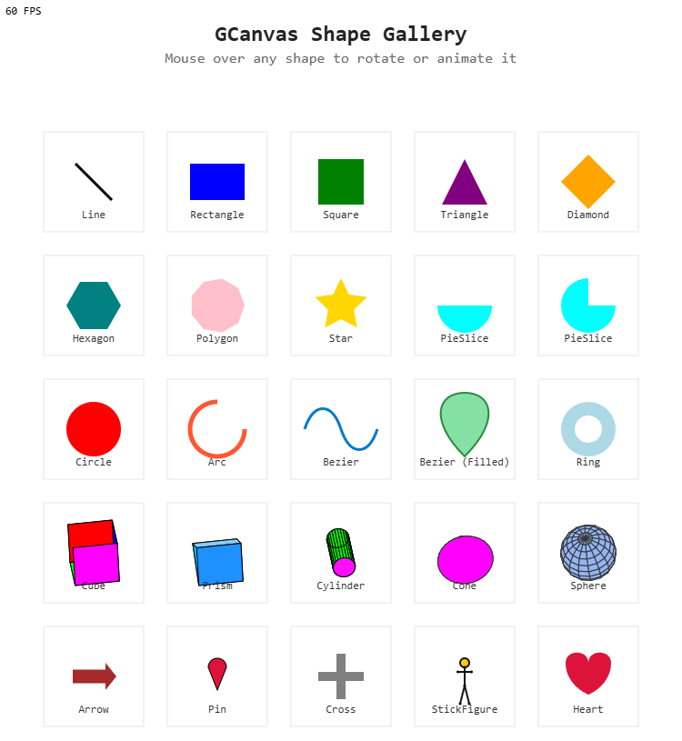

# GCanvas 🎨



A minimalist 2D canvas rendering library built for learning, expression, and creative coding.

Inspired by the simplicity of p5.js and the composability of game engines — **GCanvas** gives you structured primitives, a game loop, interactivity, and a growing set of intuitive, declarative shapes.

---

# What is this?

GCanvas is a modular 2D rendering and game framework built on top of the HTML5 Canvas API.

At its core, it's split into two powerful layers:

- 🎨 **Shape Layer** — for clean, declarative drawing via transformable primitives like `Circle`, `Rectangle`, and `Group`.
- 🎮 **Game Layer** — for interactive, updatable `GameObject`s managed through a pipeline and real-time loop.

You can use GCanvas purely for visuals, or build full simulations, games, or creative tools on top.

---

## 🌟 Features

- 💎 **Primitives** like `Circle`, `Line`, `Rectangle`, `Star`, `Polygon`, and more
- ⚽ **2.5D Shapes** like `Cube`, `Cylinder`, `Prism`, `Sphere`, `Cone`
- 📦 **Groups** for transformable shape collections
- 📈 **Transforms** — rotation, scale, constraints, group nesting
- 🖌️ **Painter API** for imperative canvas control
- 👾 **GameObjects** for updatable, interactive entities
- 📱 **UI Components** like `Button`, `ToggleButton`, `Cursor`, and layout managers
- 🎞️ **Motion API** for game-time-driven animations
- 📅 **Tweenetik** for UI-style, self-running tweens
- 🏘 **Event system** — hover, click, mouse, and touch
- 🚀 **Works with Vite, Rollup, or standalone**

---

## 📊 Demo

Open [`https://gcanvas.guinetik.com`](https://gcanvas.guinetik.com) or run:

```bash
npm run dev
```

## 🔢 API Docs

Each shape and utility is JSDoc-annotated. 
I'm organizing a docs folder on Github Pages.
For now, you can do `npm run docs` to generate the docs site.
TODO: We'll be publishing `.d.ts` typings soon for full TypeScript support.

## 🧑‍💻 Installation

️⚠️Coming soon to NPM.

For now, clone this repo:

```bash
git clone https://github.com/guinetik/gcanvas.git
cd gcanvas
npm install
```

To run our tech demos:

```bash
npm run dev
```

To build the library:

```bash
npm run build
```

To generate a readable single-file debug build:

```bash
npm run build:debug
```

---

## 🚀 Quick Start

### Using via ESM:

```js
import { Circle } from './dist/gcanvas.es.min.js';

const circle = new Circle(100, 100, 50, { fillColor: 'red' });
circle.draw(); // uses static Painter.ctx internally
```

### Using via inline script:

```html
<script src="./dist/gcanvas.umd.min.js"></script>
<script>
  const circle = new GCanvas.Circle(200, 200, 40, { fillColor: 'blue' });
  circle.draw();
</script>
```

---

## 🧠 Core Architecture

Our engine follows a layered architecture that builds from simple drawing primitives up to interactive game objects and scenes.

### 🖌️ Painter Layer

At the foundation is `Painter` - a wrapper around the canvas context that centralizes all drawing operations. Instead of working with the Canvas API directly, we use `Painter` as an intermediate layer:

```js
// Painter is initialized with a canvas context
Painter.init(ctx);

// Now drawing operations use Painter's methods
Painter.shapes.circle(100, 100, 50, { fillColor: "red" });
Painter.shapes.rect(200, 200, 80, 40, { strokeColor: "blue" });
```

### 🔄 Transformable Properties

Next we have `Transformable`, which provides standard properties for positioning and displaying objects:

- Position (`x`, `y`)
- Size (`width`, `height`) 
- Visual properties (opacity, visibility)
- Transformations (rotation, scaleX, scaleY)

Every visual element in the engine inherits from Transformable.

### 💎 Shape Layer

The Shape Layer is built on a hierarchy of classes that provide increasingly sophisticated rendering capabilities:

1. **Euclidian** - The base class that defines spatial properties (x, y, width, height)
2. **Geometry2d** - Adds bounding box calculations and constraints
3. **Transformable** - Introduces rotation and scaling capabilities
4. **Renderable** - Adds visual properties like opacity and visibility
5. **Shape** - The final layer that adds styling (fill, stroke, line width)

Each layer uses underscore-prefixed private fields (`_property`) for encapsulation, following a consistent pattern throughout the codebase:

```js
class Shape extends Transformable {
  constructor(options = {}) {
    super(options);
    this._fillColor = options.fillColor ?? null;
    this._strokeColor = options.strokeColor ?? null;
    this._lineWidth = options.lineWidth ?? 1;
  }

  get fillColor() { return this._fillColor; }
  set fillColor(v) { this._fillColor = v; }
}
```

The engine provides standard shapes like `Circle`, `Rectangle`, `Star`, etc., all built on this foundation.

### 📦 Group

`Group` is a special shape that contains other shapes. It applies its transforms to all children, allowing composite visuals to move and transform as a unit:

```js
const group = new Group(400, 300);
group.add(new Circle(0, 0, 40, { fillColor: "red" }));
group.add(new Rectangle(0, 60, 80, 30, { fillColor: "blue" }));

// All shapes draw relative to the group position
group.draw();
```

### 🪜 Pipeline

The `Pipeline` manages collections of objects that need to be updated and rendered each frame. It handles:

- The update/render sequence
- Addition/removal of objects 
- Input event dispatch to the proper objects

```js
// Create and add objects to the pipeline
pipeline.add(player);
pipeline.add(enemy);

// Pipeline handles updates in sequence
pipeline.update(dt);
pipeline.render();
```

### 🕹️ Game

The `Game` class brings everything together with:

- Canvas management
- Animation frame timing
- Input system initialization
- Pipeline management
- Motion system integration

It's the core engine that drives everything:

```js
const game = new Game(canvasElement);
game.init();  // Set up your game
game.start(); // Start the game loop
```

### ☄️ GameObject

`GameObject` extends `Transformable` and adds lifecycle methods:

- `update(dt)` — Run game logic each frame
- `render()` — Optional custom rendering 
- Event handling through `enableInteractivity(shape)`

This is the base class for all interactive entities:

```js
class Player extends GameObject {
  constructor(game) {
    super(game);
    this.shape = new Circle(100, 100, 40, { fillColor: "blue" });
    this.enableInteractivity(this.shape);
  }
  
  update(dt) {
    // Move based on input
    if (this.game.input.isKeyDown('ArrowRight')) {
      this.x += 200 * dt;
    }
  }
  
  render() {
    this.shape.draw();
  }
  
  onPointerDown(e) {
    console.log('Player clicked!');
  }
}
```

### 🖼️ Scene

`Scene` is a special GameObject that manages child GameObjects:

- Organizes objects into logical groups
- Handles nested input events 
- Manages coordinate systems for children

```js
// Create a level scene
const level = new Scene(game);
level.add(new Player(game));
level.add(new Enemy(game));

// Add scene to the game
game.pipeline.add(level);
```

### 📱 UI System

Built on top of `GameObject` and `Scene`, the UI system provides:

- `Button` — Clickable elements with visual states
- `ToggleButton` — On/off toggleable buttons
- `Cursor` — Custom cursor shapes
- Layout containers for automatic positioning:
  - `HorizontalLayout`
  - `VerticalLayout`
  - `TileLayout`

```js
const ui = new Scene(game);
const menu = new VerticalLayout(game, { 
  spacing: 20,
  align: "center" 
});

menu.add(new Button(game, "Play"));
menu.add(new Button(game, "Options"));
menu.add(new Button(game, "Quit"));

ui.add(menu);
game.pipeline.add(ui);
```

All UI elements integrate with the animation systems for smooth transitions and effects.

## Building with Layers

This architecture lets you work at the appropriate level of abstraction:

1. **Simple visuals**: Use Shape and Group directly
2. **Interactive elements**: Create GameObjects
3. **Organized worlds**: Use Scenes to structure content
4. **Complete games**: Subclass Game with your own logic
5. **Rich interfaces**: Add UI elements for player interaction

Each layer builds on the ones below, creating a flexible and powerful framework for 2D canvas games.

---

## 🎞️ Motion System

The framework provides standard easing functions along with two complementary animation systems:

### 1. `Motion` - Stateless animation primitives

The `Motion` system provides mathematical animation functions that calculate positions based on time input. These functions don't modify objects directly - instead they return values that you apply in your game logic.

```js
class Asteroid extends GameObject {
  constructor(game) {
    super(game);
    this.shape = new Circle(0, 0, 40, { fillColor: "#555" });
    this.time = 0;
  }
  
  update(dt) {
    this.time += dt;
    
    // Get position from a spiral pattern
    const result = Motion.spiral(
      400, 300,           // center point
      50, 200,            // start and end radius
      0, 3,               // start angle, revolutions
      this.time, 5,       // current time, duration
      true,               // loop
      Easing.easeInOutSine
    );
    
    // Apply the result to our shape
    this.shape.x = result.x;
    this.shape.y = result.y;
  }
  
  render() {
    this.shape.draw();
  }
}
```

Motion functions:
- `bezier` - Follows along a cubic bezier curve.
- `bounce` - Objects that drop and bounce with decreasing height
- `float` - Natural floating motion with randomness
- `follow` - Follow paths of waypoints with turning
- `orbit` - Circular or elliptical orbits
- `oscillate` - Values that cycle between min and max
- `parabolic` - Arcing projectile motion
- `patrol` - Entities that wander within bounds
- `pendulum` - Swinging motion around a pivot (cosine)
- `pulse` - Values that pulse up and down
- `shake` - Camera or object shake effects
- `spiral` - Spiral paths with variable radius
- `spring` - Physics-based spring motion
- `swing` - Rotational swinging (sine)
- `waypoint` - Character movement between points

Each function returns standardized results with position, rotation, and animation metadata like progress and completion state.

Key advantages:
- Deterministic (same input time = same output)
- No state to track between frames
- Compatible with any rendering system
- Composable through grouping and sequencing

### 2. `Tweenetik` - Property animation

The `Tweenetik` system animates object properties directly over time using easing functions:

```js
// Animate a button when pressed
onPointerDown() {
  Tweenetik.to(this.shape, 
    { scaleX: 1.2, scaleY: 1.2 }, 
    0.2, 
    Easing.easeOutBack,
    {
      onComplete: () => {
        Tweenetik.to(this.shape, 
          { scaleX: 1.0, scaleY: 1.0 }, 
          0.3, 
          Easing.easeInOutQuad
        );
      }
    }
  );
}
```

Tweenetik is ideal for:
- UI animations and transitions
- Simple property tweens
- Sequential animations with callbacks

All animations integrate with the game's update/render cycle. Tweenetik is automatically updated by the Pipeline, while Motion functions are called directly in your GameObject's update method.

### 3. `Easing` - Timing functions

Both systems use the same easing functions for consistent animation curves:

```js
Easing.easeInQuad      // accelerating
Easing.easeOutBounce   // bouncy ending
Easing.easeInOutCubic  // smooth acceleration and deceleration
// ...and many more
```

These functions transform linear time (0-1) into curved progressions for natural motion.

### 🧩 Mixins

Mixins are behavior modules that add optional functionality to any `GameObject`. They're lightweight and composable: apply only what you need.

Current mixins include:

- `applyAnchor(go, options)` — anchors the GameObject to a screen position like `"top-left"`, `"bottom-right"`, etc. Automatically repositions on resize.
- `applyDraggable(go, shape, options)` — enables drag-and-drop behavior with pointer support and optional friction.

Example:

```js
applyAnchor(myUIElement, { anchor: "top-right", padding: 20 });
applyDraggable(myCard, myCard.shape);
```

You can combine multiple mixins to build rich UI/GameObject interactions without subclassing.

Mixins can also be passed as options:
```js
// Add FPS counter
this.scene.add(
    new FPSCounter(game, {
        anchor: "bottom-right",
    })
);
```

...

## 🎓 Example

### Hello World
```html
<html lang="en">
<head>
  <meta charset="UTF-8" />
  <title>Basic Game Template</title>
</head>
<body>
  <canvas id="game"></canvas>
  <script type="module">
    import { Game, Scene, GameObject, FPSCounter, Rectangle, TextShape, Group } from "gcanvas";
    class HelloWorld extends Game {
      constructor(canvas) {
        super(canvas);
        this.enableFluidSize();
        this.backgroundColor = "black";
      }
      init() {
        // Set up scenes
        this.scene = new Scene(this);
        this.ui = new Scene(this);
        this.pipeline.add(this.scene); // game layer
        this.pipeline.add(this.ui);    // UI layer
        // Hello World box in the game scene
        this.scene.add(new HelloWorldBox(this));
        // FPS counter in the UI scene
        this.ui.add(new FPSCounter(this, { anchor: "bottom-right" }));
      }
    }

    //A Simple game object with a Shape and a Text box
    class HelloWorldBox extends GameObject {
      constructor(game) {
        super(game);

        const box = new Rectangle(0, 0, 200, 80, {
          fillColor: "#111",
          strokeColor: "#0f0",
          lineWidth: 2,
        });

        const label = new TextShape(0, 0, "Hello World!", {
          font: "18px monospace",
          color: "#0f0",
          align: "center",
          baseline: "middle"
        });

        this.group = new Group(game.width / 2, game.height / 2);
        this.group.add(box);
        this.group.add(label);
      }
      /**
       * Render the Group 
       */
      render() {
        this.group.draw();
      }
    }

    window.addEventListener("load", () => {
      const canvas = document.getElementById("game");
      const game = new HelloWorld(canvas);
      game.init();
      game.start();
    });
  </script>
</body>

</html>
```

### 🌟 GameObject with Shape

```js
class Bob extends GameObject {
  constructor(game) {
    super(game);
    this.shape = new Circle(100, 100, 40, { fillColor: "tomato" });
    this.enableInteractivity(this.shape);
  }

  update(dt) {
    this.shape.x += Math.sin(Date.now() * 0.001) * dt * 60;
  }

  render() {
    this.shape.draw();
  }
}
```

If you want to quickly wrap a `Shape` in a `GameObject` without writing a full class, you can use `ShapeGOFactory.create(...)`:

```js
const shape = new Rectangle(0, 0, 100, 50, { fillColor: "lime" });
const go = ShapeGOFactory.create(game, shape);
game.pipeline.add(go);
```

This creates a `GameObjectShapeWrapper` behind the scenes that keeps the transform in sync and draws the shape on each frame.

### 💫 Spinning Shape on Hover

```js
class SpinningShape extends GameObject {
  constructor(game) {
    super(game);
    this.shape = new Circle(200, 200, 50, { fillColor: 'cyan' });
    this.enableInteractivity(this.shape);
    this.hovered = false;

    this.on('mouseover', () => this.hovered = true);
    this.on('mouseout', () => this.hovered = false);
  }

  update(dt) {
    if (this.hovered) this.shape.rotation += 2 * dt;
  }

  render() {
    this.shape.draw();
  }
}
```

---

## 📂 File Structure

```bash
src/
├── shapes/             # All shape definitions (Circle, Triangle, Cube, etc.)
├── motion/             # Motion & Tweening systems
├── io/                 # Mouse, Touch, Input
├── game/               # Game loop, GameObject, Pipeline
├── painter.js          # Canvas context abstraction
├── index.js            # Public API entry point
```

---
```
"jsdoc": "^4.0.4"
"better-docs": "^2.7.3"
```